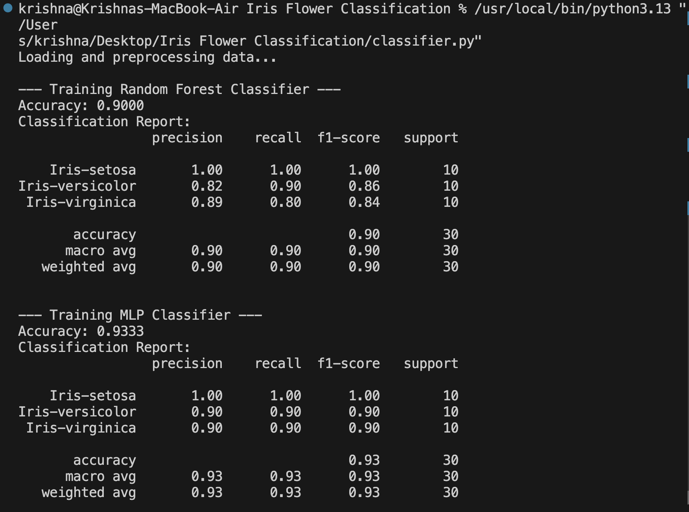

# Iris Flower Classification

A Machine Learning project that classifies Iris flowers into three species — **Setosa**, **Versicolor**, and **Virginica** — using flower measurements such as sepal length, sepal width, petal length, and petal width.

This project demonstrates the complete Machine Learning workflow including:
- Data loading and preprocessing
- Model training
- Performance evaluation
- Accuracy comparison between classifiers

---

## Features

- Uses the famous Iris Dataset
- Implements multiple ML algorithms:
  - Random Forest Classifier
  - MLP (Neural Network) Classifier
- Generates detailed classification reports
- Beginner-friendly and easy to understand
- Built using Python and Scikit-learn

---

## Tech Stack

- Python
- Scikit-learn
- NumPy
- Pandas

---

## Project Structure

```bash
Iris-Flower-Classification/
│
├── assets/               # Screenshots / output images
├── data/                 # Dataset files
├── classifier.py         # Main ML script
├── requirements.txt      # Required libraries
└── README.md             # Project documentation
```

---

## Dataset

The project uses the Iris Flower Dataset, which contains:
- 150 flower samples
- 3 flower species
- 4 numerical input features

### Features Used
- Sepal Length
- Sepal Width
- Petal Length
- Petal Width

---

## Model Performance

### Random Forest Classifier
- Accuracy: **90%**

### MLP Classifier
- Accuracy: **93.33%**

The MLP Classifier performed slightly better on the test dataset.

---

## Output Screenshot

Add your terminal output screenshot inside the `assets` folder and rename it as `output.png`.

```markdown

```

---

## Learning Outcomes

Through this project, you will learn:
- Basics of Machine Learning classification
- Data preprocessing techniques
- Model training and testing
- Accuracy evaluation
- Understanding precision, recall, and F1-score

---


## Author

**Krishna Rathore**  
B.Tech AI & Data Science Student  
Madhav Institute of Technology and Science, Gwalior
